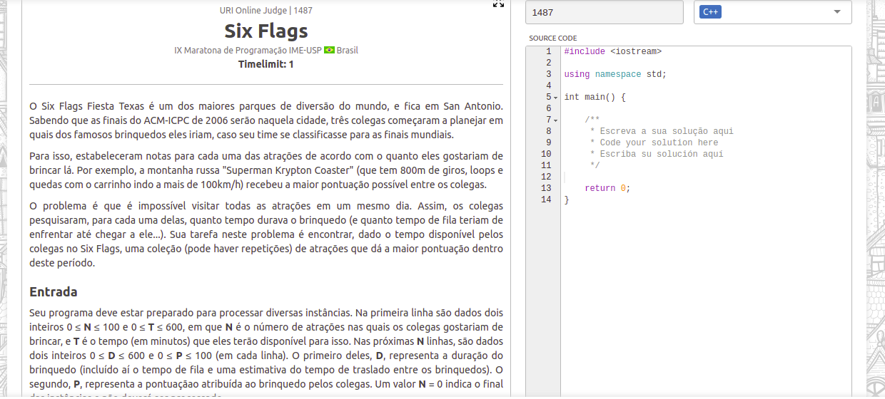
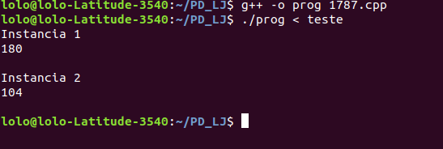

# Six flags

**Número da Lista**: X<br>
**Conteúdo da Disciplina**: Programação dinâmica<br>

## Alunos
|Matrícula | Aluno |
| -- | -- |
| 17/0013651  |  João Gabriel Antunes |
| 16/0132550  |  Lorrany Azevedo |

## Sobre 
Neste projeto nós resolvemos problemas no URI envolvendo o conteúdo de programação dinâmica 

## Screenshots



## Instalação 
**Linguagem**: C++<br>
**Framework**: (caso exista)<br>
Compilador g++.

## Uso 
Para rodar o projeto basta executar os seguintes comandos no terminal:

```console
g++ -o prog 1487.cpp
./prog < teste
```

## Outros 
Quaisquer outras informações sobre seu projeto podem ser descritas abaixo.


